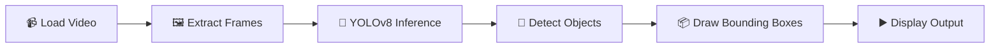

# 🚗 TYRE_COUNT - Intelligent Video-Based Object Detection System

<div align="center">


**Real-time object detection powered by YOLOv8 and OpenCV**

[Features](#-key-features) • [Installation](#️-installation--setup) • [Usage](#️-how-to-run) • [Applications](#-applications)

</div>

---

## 📌 Project Overview

This project implements an intelligent **object detection system** using deep learning and computer vision techniques. The system detects and monitors objects from video streams in real-time while maintaining original video playback speed and accuracy.

Built with **YOLOv8** (You Only Look Once) and **OpenCV**, this framework provides a robust solution for automated visual monitoring and analysis. 

---

## 🧠 Key Features

✅ **Real-time object detection** from video input  
✅ **Maintains original FPS** without speed mismatch  
✅ **Accurate bounding box visualization** with confidence scores  
✅ **Supports multiple inputs** - recorded videos and live camera feeds  
✅ **Efficient and scalable** deep learning pipeline  
✅ **Easy to customize** for different object classes  

---

## 🎯 Objectives

| Goal | Description |
|------|-------------|
| 🤖 **Automation** | Develop an automated object detection system |
| 👁️ **Efficiency** | Reduce manual video monitoring efforts |
| 🎓 **Accuracy** | Apply deep learning for high-accuracy detection |
| ⚡ **Performance** | Preserve original video playback speed |
| 🔄 **Reusability** | Provide a reusable detection framework |

---

## 🛠️ Technologies Used

### Software & Frameworks

| Technology | Purpose |
|------------|---------|
|  | Core programming language |
|  | Deep learning object detection |
|  | Computer vision processing |
|  | Numerical computations |
|  | Data visualization |

### Hardware Requirements

- 💻 **PC / Laptop** (recommended:  8GB+ RAM)
- 📹 **Webcam or video input device**
- 🎮 **GPU** (optional, but recommended for faster training)

---

## 📂 Project Structure

```
📁 TYRE_COUNT/
│
├── 📁 dataset/
│   ├── 📁 images/          # Training and validation images
│   └── 📁 labels/          # YOLO format annotations
│
├── 📁 models/
│   └── best.pt             # Trained model weights
│
├── 📄 detect.py            # Main detection script
├── 📄 train.py             # Model training script
├── 🎥 demo_video.mp4       # Sample video for testing
├── 📄 requirements.txt     # Python dependencies
└── 📄 README.md            # Project documentation
```

---

## 📊 Dataset Preparation

1. **Annotation Format**: Images annotated in YOLO format (`.txt` files)
2. **Data Split**: Dataset divided into training and validation sets
3. **Organization**: Structured directory layout for efficient processing
4. **Quality**:  High-quality labeled data for optimal model performance

---

## 🤖 Model Training

The YOLOv8 model is trained using the following approach:

- ✨ **Architecture**: YOLOv8 (latest YOLO version)
- 🔄 **Epochs**: Multiple training iterations for improved accuracy
- 💾 **Checkpointing**: Best-performing weights saved automatically
- 📈 **Metrics**: Precision, recall, and mAP tracked during training

---

## 🎥 Video Processing Workflow



1. **Load video** using OpenCV `VideoCapture`
2. **Extract frames** sequentially at original FPS
3. **Perform inference** with YOLOv8 model
4. **Detect and classify** objects with confidence scores
5. **Draw bounding boxes** with labels
6. **Display output** maintaining original frame rate

---

## ⚙️ Installation & Setup

### Prerequisites

- Python **3.9** or above
- pip package manager

### Quick Install

```bash
# Clone the repository
git clone https://github.com/KURUPRASATH-J/TYRE_COUNT.git
cd TYRE_COUNT

# Install required packages
pip install ultralytics opencv-python numpy matplotlib tqdm pillow

# Optional: Install PyTorch for GPU support
pip install torch torchvision torchaudio --index-url https://download.pytorch.org/whl/cu118
```

### Alternative:  Using requirements.txt

```bash
pip install -r requirements.txt
```

---

## ▶️ How to Run

### 1. Run Object Detection

```bash
python detect.py
```

This will:
- Load the trained model (`models/best.pt`)
- Process the input video
- Display real-time detections with bounding boxes

### 2. Train the Model (Optional)

```bash
python train.py
```

Customize training parameters in `train.py` for your specific use case.

---

## ✅ Results

| Metric | Performance |
|--------|-------------|
| 🎯 **Accuracy** | High precision object detection |
| ⚡ **Speed** | Real-time processing at original FPS |
| 🎬 **Smoothness** | No frame drops or stuttering |
| 🔄 **Reliability** | Consistent performance under varying conditions |

---

## 📌 Applications

<table>
<tr>
<td width="50%">

### Industrial & Commercial
- 🏭 **Industrial monitoring**
- 🏪 **Smart warehouses**
- 🔍 **Automated inspection**
- 📦 **Inventory management**

</td>
<td width="50%">

### Security & Research
- 🛡️ **Surveillance systems**
- 🚦 **Traffic monitoring**
- 🔬 **Computer vision research**
- 📊 **Analytics & reporting**

</td>
</tr>
</table>

---

## 🏁 Conclusion

This project presents an **effective deep learning-based approach** for real-time video object detection. By integrating **YOLOv8** with **OpenCV**, the system ensures: 

- ✅ Accurate detection with minimal false positives
- ✅ Original video playback speed preservation
- ✅ Scalable architecture for various applications
- ✅ Easy-to-use interface for deployment

The framework can be adapted for various computer vision tasks including traffic monitoring, industrial automation, and security applications.

---

## 🤝 Contributing

Contributions, issues, and feature requests are welcome! Feel free to check the [issues page](https://github.com/KURUPRASATH-J/TYRE_COUNT/issues).

---

## 📄 License

This project is licensed under the MIT License - see the LICENSE file for details.

---


<div align="center">

### ⭐ Star this repo if you find it helpful!

**Made with ❤️ using YOLOv8 and OpenCV**

</div>
