# 🚗 TYRE_COUNT - Intelligent Stereo Vision Measurement & Object Detection System

<div align="center">


**Advanced stereo vision height measurement & real-time object detection powered by YOLOv8, OpenCV, and Streamlit**

[Features](#-key-features) • [Installation](#️-installation--setup) • [Usage](#️-how-to-run) • [Dashboard](#-interactive-dashboard) • [Applications](#-applications)

</div>

---

## 📌 Project Overview

This project implements an **intelligent measurement and object detection system** using deep learning and computer vision techniques. It combines stereo vision for precise height measurements with real-time object detection capabilities. 

The system features:
- **Stereo Vision Height Measurement**:  Accurate 3D height calculations using calibrated stereo cameras
- **Real-time Object Detection**: YOLOv8-powered detection and tracking
- **Interactive Dashboard**:  Streamlit-based visualization for measurement analysis
- **Quality Control**: Automated quality checks and outlier detection

Built with **YOLOv8** (You Only Look Once), **OpenCV**, and **Streamlit**, this framework provides a robust solution for automated visual monitoring, measurement, and analysis.

---

## 🧠 Key Features

✅ **Stereo vision height measurement** with sub-millimeter accuracy  
✅ **Real-time object detection** from video input  
✅ **Interactive Streamlit dashboard** for data visualization  
✅ **Automated quality checks** and outlier filtering  
✅ **Calibration verification tools** for stereo camera setup  
✅ **Maintains original FPS** without speed mismatch  
✅ **Accurate bounding box visualization** with confidence scores  
✅ **Supports multiple inputs** - recorded videos and live camera feeds  
✅ **CSV data export** for further analysis  
✅ **Comprehensive documentation** with web interface

---

## 🎯 Objectives

| Goal | Description |
|------|-------------|
| 🤖 **Automation** | Develop automated measurement and detection systems |
| 👁️ **Precision** | Achieve accurate 3D measurements using stereo vision |
| 📊 **Visualization** | Provide interactive dashboards for data analysis |
| 🎓 **Accuracy** | Apply deep learning for high-accuracy detection |
| ⚡ **Performance** | Preserve original video playback speed |
| 🔄 **Reusability** | Provide reusable measurement and detection frameworks |

---

## 🛠️ Technologies Used

### Software & Frameworks

| Technology | Purpose |
|------------|---------|
|  | Core programming language |
|  | Deep learning object detection |
|  | Computer vision processing & stereo vision |
|  | Interactive dashboard and data visualization |
|  | Numerical computations & 3D calculations |
|  | Data analysis and manipulation |

### Hardware Requirements

- 💻 **PC / Laptop** (recommended:  8GB+ RAM)
- 📹 **Stereo camera setup** or dual video input devices
- 🎮 **GPU** (optional, but recommended for faster processing)

---

## 📂 Project Structure

```
📁 TYRE_COUNT/
│
├── 📁 project/                    # Main measurement project
│   ├── 📄 height.py              # Stereo vision height measurement script
│   ├── 📄 calibveri.py           # Calibration verification tool
│   ├── 📄 dashboard.py           # 📊 Streamlit interactive dashboard
│   ├── 📄 README_DASHBOARD.md    # Dashboard documentation
│   ├── 📄 best. pt                # Trained YOLOv8 model weights
│   ├── 📄 stereo_calibration.npz # Stereo camera calibration data
│   └── 📄 measurement_data.json  # Measurement results (generated)
│
├── 📁 web_page/                   # Documentation website
│   ├── 📄 index.html             # Project documentation page
│   ├── 📄 style.css              # Styling for documentation
│   └── 📄 script.js              # Interactive features
│
├── 📁 dataset/                    # Training dataset (optional)
│   ├── 📁 images/                # Training and validation images
│   └── 📁 labels/                # YOLO format annotations
│
├── 📄 requirements.txt            # Python dependencies
└── 📄 README.md                   # Project documentation (this file)
```

---

## ⚙️ Installation & Setup

### Prerequisites

- Python **3.9** or above
- pip package manager
- Stereo camera calibration data (for measurement features)

### Quick Install

```bash
# Clone the repository
git clone https://github.com/KURUPRASATH-J/TYRE_COUNT.git
cd TYRE_COUNT

# Install required packages
pip install ultralytics opencv-python numpy pandas streamlit matplotlib tqdm pillow

# Optional: Install PyTorch for GPU support
pip install torch torchvision torchaudio --index-url https://download.pytorch.org/whl/cu118
```

### Alternative:  Using requirements.txt

```bash
pip install -r requirements.txt
```

---

## ▶️ How to Run

### 1. 📏 Stereo Vision Height Measurement

Navigate to the `project` directory and run:

```bash
cd project
python height.py
```

This will:
- Load stereo camera videos (`leftdetect. mp4` and `rightdetct.mp4`)
- Perform YOLOv8 object detection on both camera feeds
- Calculate 3D heights using triangulation
- Apply quality checks and outlier filtering
- Generate `measurement_data.json` with all measurements
- Create verification video (`height_verification.mp4`)

**Configuration** (in `height.py`):
- `CONF_THRESH_CAM1/CAM2`: Detection confidence thresholds
- `MIN_CONFIDENCE_CAM1/CAM2`: Quality check thresholds
- `MAX_FRAMES`: Number of measurements to collect
- `TOP_CROP/BOTTOM_CROP`: Measurement point adjustment

### 2. 📊 Interactive Dashboard

After running the measurement script, launch the Streamlit dashboard:

```bash
streamlit run dashboard.py
```

The dashboard will automatically open in your web browser at `http://localhost:8501`

**Dashboard Features:**
- 📈 **Real-time Statistics**: Median, mean, min/max heights, and standard deviation
- 🖼️ **Detected Images**: View frames with detections
- 📋 **Measurements Table**: Browse all measurements with frame numbers and confidence scores
- 📥 **CSV Export**: Download measurement data
- 🎯 **Item Count**: Automatic calculation based on unit height (21. 5mm)

### 3. 🔍 Calibration Verification

To verify your stereo camera calibration:

```bash
python calibveri.py
```

**Instructions:**
- Click 4 points in order:  TOP-Cam1, BOTTOM-Cam1, TOP-Cam2, BOTTOM-Cam2
- Press 'n' for next frame
- Press 'ESC' to exit

### 4. 🎯 Object Detection (Legacy)

For basic object detection on single videos:

```bash
python detect.py  # (if available in your setup)
```

### 5. 🎓 Model Training (Optional)

To train a custom YOLOv8 model: 

```bash
python train.py
```

Customize training parameters in `train.py` for your specific use case.

---

## 📊 Interactive Dashboard

The **Streamlit dashboard** (`dashboard.py`) provides comprehensive visualization of measurement results:

### Dashboard Sections

#### 📍 Summary
- **Final Height (median)**: Robust central measurement
- **Item Count**: Calculated based on 21.5mm unit height
- **Valid Measurements**: Number of quality-approved measurements

#### 🎬 Detection Frames
- Frame range and count
- Complete list of frames with detections
- Frame selection for detailed view

#### 🖼️ Detected Images
- Select and view any detected frame
- Source video:  `height_verification.mp4`, `leftdetect.mp4`, or `left. mp4`
- Thumbnail grid for quick browsing (up to 24 frames)

#### 📋 Measurements Table
- Frame-by-frame measurement data
- Height (mm) and item count per frame
- Camera confidence scores (Cam1 & Cam2)
- Sortable and filterable
- CSV download capability

### Sample Dashboard View

```
📏 Stereo Vision Height Measurement Dashboard

Summary
┌──────────────┬──────────────┬──────────────┐
│ Final Height │  Item Count  │    Valid     │
│  215.34 mm   │     10       │      95      │
└──────────────┴──────────────┴──────────────┘

Detection Frames
Total detection frames: 95
Frame range: 0 – 94

Detected Images
[Frame selector dropdown]
[Image display with bounding boxes]

Measurements
Frame | Height (mm) | Items | Cam1 Conf | Cam2 Conf
------|-------------|-------|-----------|----------
    0 |      214.52 |    10 |     0.892 |     0.867
    1 |      215.34 |    10 |     0.901 |     0.878
  ...  |         ...  |   ... |       ... |       ...
```

---

## 🎥 Measurement Workflow

```mermaid
graph LR
    A[📹 Stereo Cameras] --> B[🖼️ Frame Capture]
    B --> C[🧠 YOLOv8 Detection]
    C --> D[🎯 Bounding Boxes]
    D --> E[📐 Triangulation]
    E --> F[✅ Quality Checks]
    F --> G[📊 Height Calculation]
    G --> H[💾 Save Results]
    H --> I[📈 Dashboard Visualization]
```



### Processing Steps

1. **Capture Frames**: Load synchronized frames from stereo cameras
2. **Undistort Images**: Apply camera calibration parameters
3. **YOLOv8 Detection**:  Detect objects in both camera views
4. **Quality Checks**:  Validate confidence, box area, and dimensions
5. **Triangulation**: Calculate 3D coordinates from 2D points
6. **Height Calculation**:  Compute vertical distance between points
7. **Outlier Filtering**: Remove measurements deviating from median
8. **Save Results**: Export to JSON and generate verification video
9. **Visualization**: Display results in Streamlit dashboard

---

## ✅ Results & Quality Metrics

| Metric | Performance |
|--------|-------------|
| 🎯 **Accuracy** | Sub-millimeter precision with calibrated stereo vision |
| ⚡ **Speed** | Real-time processing at original FPS |
| 📊 **Success Rate** | 95%+ of dual detections pass quality checks |
| 🔄 **Reliability** | Consistent performance with outlier rejection |
| 🎬 **Visualization** | Interactive dashboard with frame-by-frame analysis |

### Quality Control Features

- **Confidence Filtering**:  Minimum confidence thresholds per camera
- **Box Size Validation**: Minimum area and dimension requirements
- **Outlier Detection**: Reject measurements deviating >30mm from median
- **Dual Detection**: Requires successful detection in both cameras
- **Statistics**: Mean, median, std dev, and range calculations

---

## 📌 Applications

<table>
<tr>
<td width="50%">

### Industrial & Manufacturing
- 🏭 **Quality control inspection**
- 📏 **Dimensional measurement**
- 📦 **Package height verification**
- 🔍 **Automated sorting systems**
- 📊 **Statistical process control**

</td>
<td width="50%">

### Research & Development
- 🔬 **Computer vision research**
- 🎓 **Stereo vision studies**
- 📐 **3D reconstruction**
- 🤖 **Robotics applications**
- 📈 **Measurement automation**

</td>
</tr>
</table>

---

## 🌐 Web Documentation

This project includes a comprehensive **interactive web documentation** in the `web_page/` directory:

- **index.html**: Complete installation and usage guide
- **style. css**: Modern, responsive styling
- **script. js**: Interactive features (code copying, FAQ toggles, smooth navigation)

To view the documentation, simply open `web_page/index.html` in your browser.

---

## 🔧 Configuration Guide

### Camera Calibration

1.  Perform stereo camera calibration using OpenCV
2. Save calibration data to `stereo_calibration.npz`
3. Required parameters:  `K1`, `D1`, `K2`, `D2`, `R`, `T`

### Detection Settings

Edit `height.py` to adjust:
- `CONF_THRESH_CAM1/CAM2`: Lower for more detections, higher for fewer false positives
- `MIN_CONFIDENCE_CAM1/CAM2`: Quality threshold for accepting measurements
- `MIN_BOX_AREA`: Minimum detection size in pixels²
- `MAX_HEIGHT_VARIATION`: Outlier rejection sensitivity (mm)

### Measurement Points

- `TOP_CROP`: Offset from box top (0. 11 = 11% from top)
- `BOTTOM_CROP`: Offset from box bottom (0.27 = 27% from bottom)

---

## 🏁 Conclusion

This project presents an **integrated deep learning and stereo vision solution** for precise measurement and detection tasks. By combining **YOLOv8**, **OpenCV stereo vision**, and **Streamlit visualization**, the system ensures:

- ✅ Accurate 3D measurements with quality validation
- ✅ Real-time object detection and tracking
- ✅ Interactive data visualization and analysis
- ✅ Automated quality control and outlier filtering
- ✅ Easy-to-use interface for deployment
- ✅ Comprehensive documentation and tools

The framework can be adapted for various applications including manufacturing quality control, industrial automation, dimensional inspection, and computer vision research. 

---

## 📝 File Descriptions

### Core Measurement Files (project/)

- **`height.py`**: Main stereo vision measurement script with YOLOv8 detection, quality checks, and JSON export
- **`dashboard.py`**: Streamlit interactive dashboard for visualizing measurement results
- **`calibveri.py`**: Manual calibration verification tool with click-based height measurement
- **`README_DASHBOARD.md`**: Detailed dashboard documentation and usage guide

### Web Documentation (web_page/)

- **`index.html`**: Interactive project documentation with installation guides
- **`style.css`**: Modern CSS styling with dark theme
- **`script.js`**: Interactive JavaScript features (copy buttons, FAQ, navigation)

### Data Files

- **`best.pt`**: Trained YOLOv8 model weights
- **`stereo_calibration.npz`**: Camera calibration parameters
- **`measurement_data.json`**: Generated measurement results (created by height.py)

---

## 🤝 Contributing

Contributions, issues, and feature requests are welcome! Feel free to check the [issues page](https://github.com/KURUPRASATH-J/TYRE_COUNT/issues).

---

## 📄 License

This project is licensed under the MIT License - see the LICENSE file for details.

---

## 🚀 Quick Start Commands

```bash
# Clone the repository
git clone https://github.com/KURUPRASATH-J/TYRE_COUNT.git
cd TYRE_COUNT

# Install dependencies
pip install -r requirements.txt

# Run measurement (in project/ directory)
cd project
python height.py

# Launch dashboard
streamlit run dashboard.py

# Verify calibration (optional)
python calibveri.py
```

---

<div align="center">

### ⭐ Star this repo if you find it helpful!

**Made with ❤️ using YOLOv8, OpenCV, and Streamlit**


</div>
